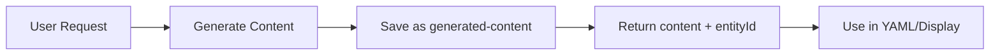
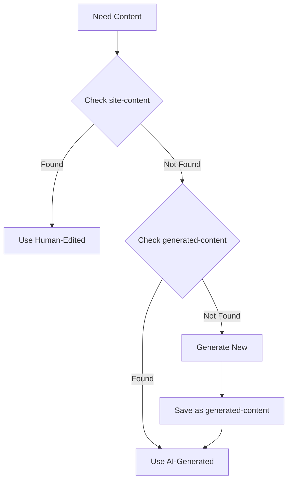
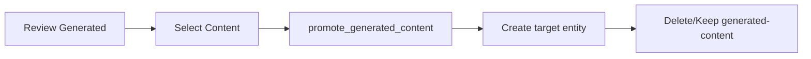

# Content Generation Integration Plan

## Overview

This document describes the integrated flow for content generation, persistence, and management across the shell and webserver plugin. It clarifies how `generated-content` and `site-content` entities work together to provide a fluent content management experience.

## Entity Types

### 1. generated-content

- **Purpose**: Store all AI-generated content with full context
- **Scope**: Generic, used by any part of the system
- **Lifetime**: Permanent until explicitly deleted
- **Location**: Shell package (core functionality)

### 2. site-content

- **Purpose**: Store human-reviewed/edited website content
- **Scope**: Specific to webserver plugin
- **Lifetime**: Permanent, the "source of truth" for website
- **Location**: Webserver plugin

## Content Flow

### Generation Phase



1. Any content generation request can specify `save: true`
2. This creates a `generated-content` entity with:
   - The generated data
   - Original prompt
   - Context used
   - Timestamp and model info
3. Returns both the content AND the entity ID for reference

### Usage Phase



Priority order:

1. **site-content** - Always preferred (human overrides AI)
2. **generated-content** - Good fallback (cached AI results)
3. **Generate new** - Only if nothing exists

### Promotion Phase



The promotion process:

1. User reviews generated content (via list tool or preview)
2. Selects specific generated-content by ID
3. Tool promotes it to the appropriate entity type
4. Optionally removes the generated-content

## Query and Search Filtering

### Preventing AI Feedback Loops

To prevent AI-generated content from contaminating future queries and generations, `generated-content` entities are excluded from normal search and query operations:

```typescript
// QueryProcessor automatically excludes generated-content
class QueryProcessor {
  async processQuery(query: string, options?: QueryOptions) {
    // Always exclude generated-content from context
    const excludedTypes = [
      "generated-content",
      ...(options?.excludeTypes || []),
    ];

    // Search for entities to include as context
    const searchResults = await this.entityService.search(query, {
      ...options,
      excludeTypes: excludedTypes,
    });

    // Continue with normal processing
  }
}

// EntityService search supports exclusion
interface SearchOptions {
  limit?: number;
  offset?: number;
  types?: string[]; // Include only these types
  excludeTypes?: string[]; // Exclude these types (e.g., ["generated-content"])
}
```

### Key Principles

1. **generated-content is quarantined**: Never appears in search results or query context
2. **Promotion makes content "real"**: Once promoted to another entity type, it's treated as legitimate content
3. **No provenance tracking needed**: Promoted content is considered reviewed and approved
4. **Explicit access only**: generated-content can only be accessed through specific tools

## Implementation Details

### Content Generation Service

```typescript
// Already implemented in shell
const result = await contentGenerationService.generate({
  schema: heroSchema,
  prompt: "Generate hero section",
  context: { ... }
});

// Returns just the content
```

### MCP Tool Enhancement

```typescript
// generate_content tool
server.tool("generate_content", {
  prompt: z.string(),
  schemaName: z.string().optional(),
  context: z.object({...}).optional(),
  save: z.boolean().optional().default(false),
  contentType: z.string().optional(), // For filtering later
}, async (params) => {
  const result = await contentAdapter.generateContent(params);

  if (params.save) {
    const entity = await entityService.createEntity({
      entityType: "generated-content",
      contentType: params.contentType || params.schemaName || "unstructured",
      schemaName: params.schemaName || "unstructured",
      data: result,
      content: JSON.stringify(result, null, 2),
      metadata: {
        prompt: params.prompt,
        context: params.context,
        generatedAt: new Date().toISOString(),
        generatedBy: "claude-3-sonnet",
        regenerated: false,
      },
    });

    return {
      content: result,
      entityId: entity.id,
      message: `Generated and saved as entity ${entity.id}`
    };
  }

  return { content: result };
});
```

### Webserver Plugin Integration

```typescript
class ContentGenerator {
  async generateLandingPage(): Promise<void> {
    // Try to get content with fallback chain
    const heroContent = await this.getContentWithFallback(
      "landing",
      "hero",
      async () => {
        // Generate new content
        const result = await this.context.generateContent({
          prompt: "Generate landing page hero section",
          schemaName: "landing-hero",
          save: true, // Save for future reference
          contentType: "landing-hero",
          context: {
            siteTitle: this.options.siteTitle,
            siteDescription: this.options.siteDescription,
          },
        });
        return result.content;
      },
    );

    // Write to YAML for Astro
    await this.writeYamlFile("landing", "index.yaml", heroContent);
  }

  private async getContentWithFallback(
    page: string,
    section: string,
    generateFn: () => Promise<any>,
  ): Promise<any> {
    // 1. Check site-content (human-edited)
    const siteContent = await this.findSiteContent(page, section);
    if (siteContent) {
      this.logger.info(`Using human-edited content for ${page}/${section}`);
      return siteContent.data;
    }

    // 2. Check generated-content (AI-generated)
    const generatedContent = await this.findGeneratedContent(
      `${page}-${section}`,
    );
    if (generatedContent) {
      this.logger.info(
        `Using previously generated content for ${page}/${section}`,
      );
      return generatedContent.data;
    }

    // 3. Generate new
    this.logger.info(`Generating new content for ${page}/${section}`);
    return generateFn();
  }

  private async findGeneratedContent(
    contentType: string,
  ): Promise<GeneratedContent | null> {
    const entities = await this.entityService.listEntities(
      "generated-content",
      {
        filter: {
          metadata: { contentType },
        },
        limit: 1,
        sortBy: "created",
        sortDirection: "desc",
      },
    );

    return entities[0] || null;
  }
}
```

### EntityService Enhancement

```typescript
// Add to EntityService class
class EntityService {
  /**
   * Derive a new entity from an existing entity
   * Useful for creating entities based on generated content or transforming between types
   */
  async deriveEntity<T extends BaseEntity>(
    sourceEntityId: string,
    sourceEntityType: string,
    targetEntityType: string,
    additionalFields?: Partial<T>,
    options?: { deleteSource?: boolean },
  ): Promise<T> {
    // Get the source entity
    const source = await this.getEntity(sourceEntityType, sourceEntityId);
    if (!source) {
      throw new Error(
        `Source entity not found: ${sourceEntityType}/${sourceEntityId}`,
      );
    }

    // Create the derived entity with merged data
    const derived = await this.createEntity<T>({
      ...source.data,
      ...additionalFields,
      entityType: targetEntityType,
      content: JSON.stringify(source.data || source, null, 2),
    } as T);

    // Optionally delete the source
    if (options?.deleteSource) {
      await this.deleteEntity(sourceEntityId);
    }

    this.logger.info(
      `Derived ${targetEntityType} ${derived.id} from ${sourceEntityType} ${sourceEntityId}`,
    );

    return derived;
  }
}
```

### Content Management Tools

```typescript
// List generated content for review
server.tool(
  "list_generated_content",
  {
    contentType: z.string().optional(),
    limit: z.number().optional().default(10),
  },
  async (params) => {
    const entities = await entityService.listEntities("generated-content", {
      filter: params.contentType
        ? { metadata: { contentType: params.contentType } }
        : {},
      limit: params.limit,
      sortBy: "created",
      sortDirection: "desc",
    });

    return entities.map((e) => ({
      id: e.id,
      contentType: e.contentType,
      prompt: e.metadata.prompt,
      generatedAt: e.metadata.generatedAt,
      preview: JSON.stringify(e.data).substring(0, 200) + "...",
    }));
  },
);

// Promote generated content to target entity type
server.tool(
  "promote_generated_content",
  {
    generatedContentId: z.string(),
    targetEntityType: z.string(),
    additionalFields: z.record(z.unknown()).optional(),
    deleteOriginal: z.boolean().optional().default(false),
  },
  async (params) => {
    const promoted = await entityService.deriveEntity(
      params.generatedContentId,
      "generated-content",
      params.targetEntityType,
      params.additionalFields,
      { deleteSource: params.deleteOriginal },
    );

    return {
      promotedId: promoted.id,
      promotedType: promoted.entityType,
      message: `Promoted to ${promoted.entityType}: ${promoted.id}`,
    };
  },
);

// Preview generated content
server.tool(
  "preview_generated_content",
  {
    generatedContentId: z.string(),
  },
  async (params) => {
    const entity = await entityService.getEntity(
      "generated-content",
      params.generatedContentId,
    );

    if (!entity) {
      throw new Error("Generated content not found");
    }

    return {
      id: entity.id,
      contentType: entity.contentType,
      prompt: entity.metadata.prompt,
      generatedAt: entity.metadata.generatedAt,
      data: entity.data,
    };
  },
);

// Regenerate content (creates new version)
server.tool(
  "regenerate_content",
  {
    contentType: z.string(),
    prompt: z.string().optional(),
    context: z.object({}).optional(),
  },
  async (params) => {
    // Find existing generated content
    const existing = await entityService.listEntities("generated-content", {
      filter: { metadata: { contentType: params.contentType } },
      limit: 1,
    });

    const oldPrompt = existing[0]?.metadata.prompt;
    const oldContext = existing[0]?.metadata.context;

    // Generate new version
    const result = await contentGenerationService.generate({
      prompt: params.prompt || oldPrompt,
      context: params.context || oldContext,
      save: true,
      contentType: params.contentType,
    });

    return {
      newId: result.entityId,
      oldId: existing[0]?.id,
      message: "New version generated",
    };
  },
);
```

### Plugin-Specific Promotion Tools

Plugins can create specialized promotion tools that use the generic EntityService method:

```typescript
// Example: Webserver plugin's specialized tool
server.tool(
  "promote_to_site_content",
  {
    generatedContentId: z.string(),
    page: z.string(),
    section: z.string(),
  },
  async (params) => {
    // Use EntityService.deriveEntity with site-content specifics
    const promoted = await entityService.deriveEntity(
      params.generatedContentId,
      "generated-content",
      "site-content",
      {
        page: params.page,
        section: params.section,
        title: `${params.page} - ${params.section}`,
      },
    );

    return {
      siteContentId: promoted.id,
      message: `Promoted to site-content for ${params.page}/${params.section}`,
    };
  },
);
```

## User Workflows

### Initial Site Setup

1. Run `build_site`
2. Plugin generates all content, saving as `generated-content` entities
3. Site is built with AI-generated content
4. User previews site

### Content Refinement

1. Run `list_generated_content` to see all generated content
2. Run `preview_generated_content` to review specific content
3. Run `promote_generated_content` to promote content to target entity type
4. Edit promoted content as regular entities
5. Future builds use the promoted content

### Content Regeneration

1. Run `regenerate_content` with new prompt/context
2. Compare new vs old with `preview_generated_content`
3. If better, promote the new version
4. Old versions remain in history

## Benefits

1. **Full Traceability**: Every piece of generated content is tracked
2. **Selective Adoption**: Choose what to promote to production
3. **Iterative Improvement**: Regenerate with better prompts
4. **Version History**: Keep all generations for comparison
5. **Clean Separation**: Generated vs human-edited content
6. **No Lost Work**: All generations are saved automatically

## Migration Notes

For existing implementations:

1. The `generated-content` entity type is already registered in shell
2. Update `generate_content` MCP tool to support `save` parameter
3. Update webserver plugin to check both entity types
4. Add new management tools for content workflows
5. **Critical**: Update QueryProcessor and EntityService to exclude `generated-content` from searches
6. Implement `deriveEntity` method on EntityService
7. Add `promote_generated_content` tool to shell MCP tools
