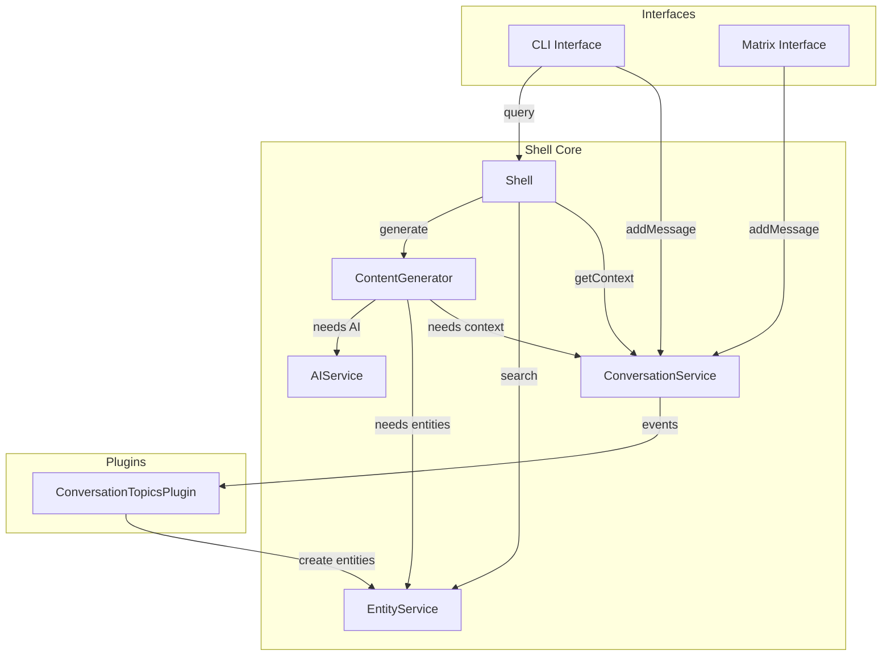

# Conversation Memory Architecture Revision

## Executive Summary

After implementing the initial conversation memory plugin and analyzing the system's needs, we've determined that conversation context is **fundamental infrastructure** required by the ContentGenerator to produce coherent responses. This document proposes splitting conversation memory into:

1. **ConversationService** (Shell Service) - Core infrastructure for storing and retrieving conversations
2. **ConversationTopicsPlugin** (Plugin) - Optional AI-powered summarization and topic extraction

## The Problem

The current ConversationMemoryPlugin conflates two distinct concerns:

1. **Infrastructure**: Storing/retrieving conversation history for context
2. **Feature**: AI-powered topic extraction and summarization

The ContentGenerator needs conversation context to generate relevant responses, making it a core dependency like EntityService or AIService.

## Analysis: Why a Shell Service?

### Shell Service Criteria

- **Universal Need**: Required by core system components
- **Infrastructure**: Provides foundational capabilities
- **Direct Dependencies**: Other services depend on it directly

### ConversationService Meets These Criteria

1. **ContentGenerator needs it** to provide contextual AI responses
2. **All message interfaces need it** for conversation continuity
3. **Direct access required** for performance (no message bus indirection)

### Why Not Keep as Plugin?

We considered keeping everything as plugins but encountered problems:

- Complex workarounds to provide context to ContentGenerator
- Message bus blocking issues for synchronous context retrieval
- "Working memory entities" and other convoluted patterns
- Fighting the natural architecture

## Proposed Architecture

### 1. ConversationService (Shell Service)

**Location**: `shell/conversation-service/`

**Purpose**: Core infrastructure for conversation storage and retrieval

**Responsibilities**:

- Store conversations and messages in SQLite
- Provide direct API for retrieving conversation history
- Maintain "working memory" of recent messages
- Emit events for plugins to consume
- Provide conversation context to ContentGenerator

**API Interface**:

```typescript
interface IConversationService {
  // Core operations
  startConversation(sessionId: string, interfaceType: string): Promise<string>;
  addMessage(
    conversationId: string,
    role: string,
    content: string,
    metadata?: any,
  ): Promise<void>;
  getRecentMessages(conversationId: string, limit?: number): Promise<Message[]>;
  getConversation(conversationId: string): Promise<Conversation | null>;

  // Search operations
  searchConversations(
    query: string,
    sessionId?: string,
  ): Promise<SearchResult[]>;

  // Working memory
  getWorkingMemory(conversationId: string): Promise<string>;
}
```

**Events Published**:

- `conversation:started` - New conversation begins
- `conversation:messageAdded` - Message stored
- `conversation:updated` - Metadata changes

### 2. ConversationTopicsPlugin (Plugin)

**Location**: `plugins/conversation-topics/`

**Purpose**: Optional AI-powered topic extraction and summarization

**Responsibilities**:

- Subscribe to conversation events from ConversationService
- Generate topical summaries using AI
- Create searchable topic entities
- Merge similar topics using embeddings
- Manage summarization thresholds

**Configuration**:

```typescript
{
  enableAutomatic: boolean;
  minMessages: number;
  minTimeMinutes: number;
  batchSize: number;
  overlapPercentage: number;
  similarityThreshold: number;
  targetLength: number;
  maxLength: number;
}
```

## Architecture Flow



## How ContentGenerator Gets Context

```typescript
class ContentGenerator {
  constructor(dependencies: {
    aiService: IAIService;
    entityService: IEntityService;
    conversationService: IConversationService; // NEW
  }) {
    // ...
  }

  async generateContent<T>(
    templateName: string,
    context: GenerationContext,
  ): Promise<T> {
    // Search relevant entities (including topics)
    const relevantEntities = await this.dependencies.entityService.search(
      searchTerms,
      {
        limit: 5,
      },
    );

    // Get conversation context if available
    let conversationContext = "";
    if (context.conversationId) {
      // Direct access to conversation service
      const recentMessages =
        await this.dependencies.conversationService.getRecentMessages(
          context.conversationId,
          10,
        );
      conversationContext = this.formatMessages(recentMessages);
    }

    // Build enhanced prompt with both entity and conversation context
    const enhancedPrompt = this.buildPrompt(
      template,
      context,
      relevantEntities,
      conversationContext,
    );

    // Generate with full context
    return this.dependencies.aiService.generateObject(
      template.basePrompt,
      enhancedPrompt,
      template.schema,
    );
  }
}
```

## Working Memory Concept

The ConversationService maintains two types of memory:

### 1. Working Memory (Last 10-20 messages)

- Immediately available for context
- Stored in conversation service
- Directly accessed by ContentGenerator
- Provides short-term continuity

### 2. Topic Memory (Summarized knowledge)

- Created by ConversationTopicsPlugin
- Stored as searchable entities
- Found via entity search
- Provides long-term context

This dual approach ensures:

- **Immediate context** even before summarization
- **No context blindness** window
- **Both short and long-term memory**

## Implementation Plan

### Phase 1: Create ConversationService

1. **Create shell service** at `shell/conversation-service/`
2. **Move from plugin**:
   - Database schemas and setup
   - Core CRUD operations
   - Message storage logic
3. **Add to Shell**:
   - Initialize in Shell constructor
   - Add to ContentGenerator dependencies
   - Register with service registry
4. **Add event emission** for plugins

### Phase 2: Update ContentGenerator

1. **Add ConversationService dependency**
2. **Fetch conversation context** when conversationId provided
3. **Include in prompt building**
4. **No changes to entity search** (still finds topics)

### Phase 3: Create ConversationTopicsPlugin

1. **Create new plugin** at `plugins/conversation-topics/`
2. **Move from old plugin**:
   - Summarization logic
   - Topic job handler
   - Entity adapter
   - Content templates
3. **Subscribe to ConversationService events**
4. **Create topic entities** for search

### Phase 4: Update Interfaces

1. **MessageInterfacePlugin**:
   - Use ConversationService directly
   - Pass conversationId in query context
   - Remove conversation memory code
2. **Keep existing message flow**:
   - Interfaces still call handleInput
   - Still track conversations per channel

### Phase 5: Remove Old Plugin

1. **Delete** `plugins/conversation-memory/`
2. **Update** test-brain app configuration
3. **Update** all imports

## Benefits of This Architecture

### 1. Clean Dependencies

- ContentGenerator explicitly depends on ConversationService
- No message bus indirection for critical path
- Direct, synchronous access when needed

### 2. Separation of Concerns

- **Infrastructure** (storage) is a shell service
- **Feature** (AI summarization) is a plugin
- Each component has single responsibility

### 3. Performance

- Direct service calls for context retrieval
- No event overhead in query path
- Async summarization doesn't block responses

### 4. Flexibility

- Can use conversations without AI costs
- Topics plugin is optional
- Can add alternative analysis plugins

### 5. Persistence

- Conversations survive restarts
- Can continue across interfaces
- Searchable history

## Configuration Example

```typescript
// Shell initialization
const shell = new Shell({
  conversationService: {
    databaseUrl: "./conversations.db",
    workingMemorySize: 20,
    retention: {
      unlimited: true,
    },
  },
});

// Plugin configuration
new ConversationTopicsPlugin({
  enableAutomatic: true,
  minMessages: 20,
  minTimeMinutes: 60,
  similarityThreshold: 0.7,
});
```

## Comparison with Previous Approaches

| Aspect                      | Plugin-Only          | Working Memory Entities | Shell Service  |
| --------------------------- | -------------------- | ----------------------- | -------------- |
| **ContentGenerator Access** | Complex events       | Entity search           | Direct API     |
| **Performance**             | Message bus overhead | Entity search overhead  | Direct calls   |
| **Complexity**              | High (workarounds)   | High (fake entities)    | Low (explicit) |
| **Testing**                 | Complex mocks        | Complex setup           | Simple mocks   |
| **Persistence**             | Yes                  | Yes                     | Yes            |
| **Topics Support**          | Coupled              | Complex                 | Clean events   |

## Decision

Split conversation memory into:

1. **ConversationService** (Shell Service) - Infrastructure for storage/retrieval
2. **ConversationTopicsPlugin** (Plugin) - Optional AI summarization

This recognizes that conversation context is core infrastructure while AI summarization is an optional feature.
