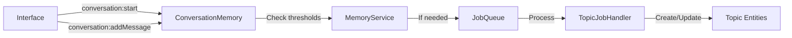

# Conversation Memory Integration Plan

## Overview

This document describes how to integrate the Conversation Memory plugin with interfaces (CLI, Matrix, MCP) now that topical summarization has been implemented. The key principle is that **interfaces simply send messages, and the plugin handles all summarization logic automatically**.

## Current Implementation Status

### ✅ Completed

- Topical summarization system with global knowledge entities
- ConversationTopicJobHandler for processing conversations
- Topic merging using embeddings (0.7 similarity threshold)
- Sliding window processing with configurable overlap
- Entity adapter for conversation topics
- Content generation templates for AI-powered summarization

### 🔄 Integration Needed

- Auto-trigger summarization in the plugin
- Add plugin to test-brain app
- Update interfaces to send conversation events

## Architecture

### Topic-Based Knowledge System

Instead of chronological summaries, the system creates **topics** that:

- Exist independently of conversations, sessions, or users
- Accumulate knowledge across all interactions
- Merge automatically when similar (≥0.7 embedding similarity)
- Store context information within content for AI readability

### Message Flow



## Integration Pattern

### Key Design Decisions

1. **Plugin Self-Managed Summarization**: The plugin automatically checks for summarization needs after each message
2. **All Messages Stored**: Interfaces store ALL messages, not just ones that get responses
3. **Interface-Specific Response Logic**: Each interface decides what messages to respond to via `shouldRespond()`
4. **Unified Conversation ID**: Use `${interfaceType}-${channelId}` to avoid collisions

### MessageInterfacePlugin Base Class Integration

The integration happens in the base `MessageInterfacePlugin` class that both CLI and Matrix extend:

```typescript
// In MessageInterfacePlugin
abstract class MessageInterfacePlugin {
  private startedConversations = new Set<string>();

  // Interfaces must implement these
  protected abstract shouldRespond(
    message: string,
    context: MessageContext,
  ): boolean;
  protected abstract showThinkingIndicators(
    context: MessageContext,
  ): Promise<void>;
  protected abstract showDoneIndicators(context: MessageContext): Promise<void>;

  protected async handleInput(
    input: string,
    context: MessageContext,
    replyToId?: string,
  ): Promise<void> {
    const conversationId = `${context.interfaceType}-${context.channelId}`;

    // 1. Start conversation if new channel (once per channel)
    if (!this.startedConversations.has(conversationId)) {
      try {
        await this.getContext().publish("conversation:start", {
          sessionId: conversationId,
          interfaceType: context.interfaceType,
          metadata: {
            user: context.userId,
            channel: context.channelId,
            interface: context.interfaceType,
          },
        });
        this.startedConversations.add(conversationId);
      } catch (error) {
        // Non-critical - continue even if conversation memory unavailable
        this.logger.debug("Could not start conversation", { error });
      }
    }

    // 2. Always store user message (even if bot won't respond)
    try {
      await this.getContext().publish("conversation:addMessage", {
        conversationId,
        role: "user",
        content: input,
        metadata: {
          messageId: context.messageId,
          userId: context.userId,
          timestamp: context.timestamp.toISOString(),
          directed: this.shouldRespond(input, context), // Track if for bot
        },
      });
    } catch (error) {
      this.logger.debug("Could not store user message", { error });
    }

    // 3. Check if bot should respond
    if (!this.shouldRespond(input, context)) {
      return; // Message stored, no response needed
    }

    // 4. Process and respond
    await this.showThinkingIndicators(context);
    const response = await this.processMessage(input, context);
    const messageId = await this.sendMessage(response, context, replyToId);

    // 5. Store assistant response
    try {
      await this.getContext().publish("conversation:addMessage", {
        conversationId,
        role: "assistant",
        content: response,
        metadata: { messageId, timestamp: new Date().toISOString() },
      });
    } catch (error) {
      this.logger.debug("Could not store assistant message", { error });
    }

    await this.showDoneIndicators(context);
  }
}
```

### Interface-Specific Implementations

#### CLI Interface

```typescript
class CLIInterface extends MessageInterfacePlugin {
  protected shouldRespond(message: string, context: MessageContext): boolean {
    return true; // CLI always responds to everything
  }

  protected async showThinkingIndicators(
    context: MessageContext,
  ): Promise<void> {
    // Could show spinner, or do nothing
  }

  protected async showDoneIndicators(context: MessageContext): Promise<void> {
    // Could clear spinner, or do nothing
  }
}
```

#### Matrix Interface

```typescript
class MatrixInterface extends MessageInterfacePlugin {
  protected shouldRespond(message: string, context: MessageContext): boolean {
    const isCommand = message.startsWith(this.config.commandPrefix);
    const isAnchorCommand = message.startsWith(this.config.anchorPrefix);
    const isMentioned = this.checkIfMentioned(message, context);

    // Check anchor command permissions
    if (isAnchorCommand && context.userId !== this.config.anchorUserId) {
      return false;
    }

    return isMentioned || isCommand || isAnchorCommand;
  }

  protected async showThinkingIndicators(
    context: MessageContext,
  ): Promise<void> {
    if (this.config.enableTypingNotifications) {
      await this.client.setTyping(context.channelId, true);
    }
    if (this.config.enableReactions) {
      await this.client.sendReaction(
        context.channelId,
        context.messageId,
        "🤔",
      );
    }
  }

  protected async showDoneIndicators(context: MessageContext): Promise<void> {
    if (this.config.enableTypingNotifications) {
      await this.client.setTyping(context.channelId, false);
    }
    if (this.config.enableReactions) {
      await this.client.sendReaction(
        context.channelId,
        context.messageId,
        "✅",
      );
    }
  }
}

// In room-events.ts - simplified handler
async function handleRoomMessage(
  event: any,
  roomId: string,
  ctx: MatrixInterface,
) {
  if (event.sender === ctx.config.userId) return; // Skip our own
  if (event.content?.msgtype !== "m.text") return; // Only text

  const cleanMessage = stripBotMentions(event.content.body);
  const context = buildMessageContext(roomId, event.sender, event.event_id);

  // Let handleInput manage everything (storage, response decision, indicators)
  await ctx.handleInput(cleanMessage, context, event.event_id);
}
```

### MCP Interface (No Conversation Memory)

MCP extends `InterfacePlugin` directly, not `MessageInterfacePlugin`, so it doesn't participate in conversation memory.

### For the Plugin (Internal Logic)

#### Key Change: Use sessionId as conversationId

The ConversationMemoryPlugin needs to be updated to use the sessionId directly as the conversationId. This simplifies the integration and makes it idempotent.

```typescript
// In conversation-memory-service.ts
async startConversation(
  sessionId: string,  // This becomes the conversationId
  interfaceType: string,
): Promise<string> {
  // Check if conversation already exists
  const existing = await this.db
    .select()
    .from(conversations)
    .where(eq(conversations.id, sessionId))
    .limit(1);
    
  if (existing.length > 0) {
    // Update last active and return existing ID
    await this.db
      .update(conversations)
      .set({ lastActive: new Date().toISOString() })
      .where(eq(conversations.id, sessionId));
    return sessionId;
  }
  
  // Create new conversation using sessionId as ID
  const now = new Date().toISOString();
  const newConversation: NewConversation = {
    id: sessionId,  // Use sessionId as the ID
    sessionId,
    interfaceType,
    started: now,
    lastActive: now,
    created: now,
    updated: now,
    metadata: JSON.stringify({}),
  };
  
  await this.db.insert(conversations).values(newConversation);
  
  // Initialize summary tracking
  await this.db.insert(summaryTracking).values({
    conversationId: sessionId,
    messagesSinceSummary: 0,
    updated: now,
  });
  
  return sessionId;
}

// Auto-summarization remains the same
async addMessage(conversationId: string, role: string, content: string, metadata?: any) {
  // ... store message ...

  // Auto-check for summarization
  if (this.config.summarization?.enableAutomatic !== false) {
    const needsSummarization = await this.checkSummarizationNeeded(conversationId);
    if (needsSummarization) {
      // Queue async job - non-blocking
      await this.createSummary(conversationId);
    }
  }
}
```

## Configuration

### Adding to test-brain App

```typescript
// apps/test-brain/src/index.ts
import { ConversationMemoryPlugin } from "@brains/conversation-memory";

plugins: [
  // ... existing plugins ...

  new ConversationMemoryPlugin({
    databaseUrl:
      process.env["CONVERSATION_DB_URL"] ?? "file:./conversations.db",
    summarization: {
      enableAutomatic: true, // Let plugin manage timing
      minMessages: 20, // Minimum messages before summarization
      minTimeMinutes: 60, // Minimum time between summaries
      batchSize: 20, // Messages per processing batch
      overlapPercentage: 0.25, // 25% overlap in sliding window
      similarityThreshold: 0.7, // Topic matching threshold
      targetLength: 400, // Target summary length in words
      maxLength: 1000, // Maximum summary length
    },
    retention: {
      unlimited: true, // Keep all conversations
    },
  }),
];
```

### Environment Variables

```bash
# Optional - defaults shown
CONVERSATION_DB_URL=file:./conversations.db
CONVERSATION_MIN_MESSAGES=20
CONVERSATION_MIN_TIME_MINUTES=60
CONVERSATION_BATCH_SIZE=20
CONVERSATION_OVERLAP_PERCENTAGE=0.25
CONVERSATION_SIMILARITY_THRESHOLD=0.7
```

## Implementation Order

### Phase 1: Update ConversationMemoryPlugin (Do First!)
1. **Modify startConversation** to use sessionId as conversationId
   - Make it idempotent (check if exists, return existing or create new)
   - Use sessionId directly as the conversation ID
2. **Update tests** for the new startConversation behavior
3. **Test the changes** independently

### Phase 2: Update MessageInterfacePlugin
1. Add `startedConversations` Set to track started conversations
2. Add abstract methods: `shouldRespond()`, `showThinkingIndicators()`, `showDoneIndicators()`
3. Update `handleInput()` to:
   - Start conversations (once per channel)
   - Store ALL messages (even ones that don't get responses)
   - Use abstract methods for response decision and indicators

### Phase 3: Update Interfaces
1. **CLIInterface**: Implement the three abstract methods
2. **MatrixInterface**: 
   - Implement the three abstract methods
   - Simplify room-events.ts to call handleInput for all messages

### Phase 4: Testing
1. Test with conversation memory enabled
2. Test with conversation memory disabled (should still work)
3. Verify all messages are stored
4. Verify topics are generated after thresholds

## Implementation Checklist

### 1. Update ConversationMemoryPlugin 
- [ ] Modify `startConversation` to use sessionId as conversationId
- [ ] Make startConversation idempotent
- [ ] Update tests for new behavior

### 2. Add to test-brain App

- [ ] Import ConversationMemoryPlugin
- [ ] Add to plugins array with configuration
- [ ] Set environment variables if needed

### 3. CLI Interface Integration

- [ ] Add conversationId property to CLIInterface class
- [ ] Emit `conversation:start` on initialization
- [ ] Emit `conversation:addMessage` for user queries
- [ ] Emit `conversation:addMessage` for assistant responses

### 4. Matrix Interface Integration

- [ ] Track conversation per room
- [ ] Emit `conversation:start` when joining room
- [ ] Emit `conversation:addMessage` for each message
- [ ] Handle multiple concurrent conversations

### 5. MCP Interface Integration

- [ ] Similar to CLI but session-based
- [ ] Track conversation per connection
- [ ] Emit events for tool interactions

## Expected Behavior

### Automatic Summarization Triggers

The plugin will automatically create topical summaries when:

1. **Message count** exceeds threshold (default: 20 messages)
2. **Time elapsed** since last summary exceeds threshold (default: 60 minutes)
3. **Idle time** detected (default: 30 minutes between messages)

### Topic Creation and Merging

1. **New Topic**: Created when no similar topics exist
2. **Topic Merge**: When similarity ≥ 0.7, new content merges with existing topic
3. **Context Preservation**: User, channel, interface info stored in content
4. **Search Enhancement**: Topics are searchable via entity service

### What Interfaces DON'T Need to Do

- ❌ Check if summarization is needed
- ❌ Trigger summarization manually
- ❌ Manage summarization state
- ❌ Handle summarization errors
- ❌ Track message counts or timing

### What Interfaces DO Need to Do

- ✅ Start conversations on session begin
- ✅ Send messages as they occur
- ✅ Include relevant metadata (optional)

## Testing Strategy

### Unit Tests

- Verify auto-summarization triggers correctly
- Test threshold calculations
- Validate topic merging logic

### Integration Tests

```typescript
// Test that messages trigger summarization
it("should automatically create topics after threshold", async () => {
  const conversationId = await service.startConversation("test-session", "cli");

  // Add 20 messages (threshold)
  for (let i = 0; i < 20; i++) {
    await service.addMessage(conversationId, "user", `Message ${i}`);
  }

  // Verify job was queued
  expect(jobQueue.getJobs("conversation-topic")).toHaveLength(1);
});
```

### End-to-End Tests

1. Start CLI with conversation memory
2. Have conversation with 20+ messages
3. Verify topics are created in entity service
4. Search for content and verify topics returned

## Benefits of This Approach

1. **Simplicity**: Interfaces have minimal integration code
2. **Consistency**: Same behavior across all interfaces
3. **Maintainability**: Logic centralized in plugin
4. **Performance**: Async processing doesn't block interactions
5. **Flexibility**: Still configurable per deployment
6. **Reliability**: Plugin handles all edge cases

## Migration Notes

For existing deployments:

- Plugin can be added without breaking changes
- Existing conversations continue to work
- Topics will be created for new messages only
- No data migration required

## Future Enhancements

- Topic hierarchies and relationships
- Cross-conversation topic linking
- Topic evolution tracking
- Manual topic management commands
- Topic export/import functionality
