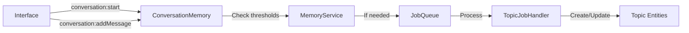

# Conversation Memory Integration Plan

## Overview

This document describes how to integrate the Conversation Memory plugin with interfaces (CLI, Matrix, MCP) now that topical summarization has been implemented. The key principle is that **interfaces simply send messages, and the plugin handles all summarization logic automatically**.

## Current Implementation Status

### ✅ Completed
- Topical summarization system with global knowledge entities
- ConversationTopicJobHandler for processing conversations
- Topic merging using embeddings (0.7 similarity threshold)
- Sliding window processing with configurable overlap
- Entity adapter for conversation topics
- Content generation templates for AI-powered summarization

### 🔄 Integration Needed
- Auto-trigger summarization in the plugin
- Add plugin to test-brain app
- Update interfaces to send conversation events

## Architecture

### Topic-Based Knowledge System

Instead of chronological summaries, the system creates **topics** that:
- Exist independently of conversations, sessions, or users
- Accumulate knowledge across all interactions
- Merge automatically when similar (≥0.7 embedding similarity)
- Store context information within content for AI readability

### Message Flow



## Integration Pattern

### Key Design Decision: Plugin Self-Managed Summarization

The plugin automatically checks for summarization needs after each message. Interfaces don't need to manage this logic.

### For Interfaces (CLI, Matrix, MCP)

```typescript
// 1. On startup/session start
const response = await messageBus.publish("conversation:start", {
  sessionId: this.sessionId,  // CLI session ID, Matrix room ID, etc.
  interfaceType: "cli",       // or "matrix", "mcp"
  metadata: {                 // Optional metadata
    user: userId,
    channel: channelName,
  }
});
this.conversationId = response.data.conversationId;

// 2. When processing messages
// Before processing user query
await messageBus.publish("conversation:addMessage", {
  conversationId: this.conversationId,
  role: "user",
  content: userQuery,
  metadata: {
    command: extractedCommand,  // Optional
    timestamp: new Date().toISOString(),
  }
});

// Process the query...
const response = await this.processQuery(userQuery);

// After getting response
await messageBus.publish("conversation:addMessage", {
  conversationId: this.conversationId,
  role: "assistant",
  content: response,
  metadata: {
    processingTime: elapsedMs,
  }
});

// 3. That's it! Plugin handles summarization automatically
```

### For the Plugin (Internal Logic)

```typescript
// In conversation-memory-service.ts
async addMessage(conversationId: string, role: string, content: string, metadata?: any) {
  // ... store message ...
  
  // Auto-check for summarization (NEW)
  if (this.config.summarization?.enableAutomatic !== false) {
    const needsSummarization = await this.checkSummarizationNeeded(conversationId);
    if (needsSummarization) {
      // Queue async job - non-blocking
      await this.createSummary(conversationId);
    }
  }
}
```

## Configuration

### Adding to test-brain App

```typescript
// apps/test-brain/src/index.ts
import { ConversationMemoryPlugin } from "@brains/conversation-memory";

plugins: [
  // ... existing plugins ...
  
  new ConversationMemoryPlugin({
    databaseUrl: process.env["CONVERSATION_DB_URL"] ?? "file:./conversations.db",
    summarization: {
      enableAutomatic: true,      // Let plugin manage timing
      minMessages: 20,            // Minimum messages before summarization
      minTimeMinutes: 60,         // Minimum time between summaries
      batchSize: 20,              // Messages per processing batch
      overlapPercentage: 0.25,    // 25% overlap in sliding window
      similarityThreshold: 0.7,   // Topic matching threshold
      targetLength: 400,          // Target summary length in words
      maxLength: 1000,           // Maximum summary length
    },
    retention: {
      unlimited: true,            // Keep all conversations
    }
  }),
]
```

### Environment Variables

```bash
# Optional - defaults shown
CONVERSATION_DB_URL=file:./conversations.db
CONVERSATION_MIN_MESSAGES=20
CONVERSATION_MIN_TIME_MINUTES=60
CONVERSATION_BATCH_SIZE=20
CONVERSATION_OVERLAP_PERCENTAGE=0.25
CONVERSATION_SIMILARITY_THRESHOLD=0.7
```

## Implementation Checklist

### 1. Update Plugin for Auto-Summarization
- [ ] Modify `addMessage` in conversation-memory-service.ts
- [ ] Add automatic threshold checking
- [ ] Queue summarization job when needed

### 2. Add to test-brain App
- [ ] Import ConversationMemoryPlugin
- [ ] Add to plugins array with configuration
- [ ] Set environment variables if needed

### 3. CLI Interface Integration
- [ ] Add conversationId property to CLIInterface class
- [ ] Emit `conversation:start` on initialization
- [ ] Emit `conversation:addMessage` for user queries
- [ ] Emit `conversation:addMessage` for assistant responses

### 4. Matrix Interface Integration
- [ ] Track conversation per room
- [ ] Emit `conversation:start` when joining room
- [ ] Emit `conversation:addMessage` for each message
- [ ] Handle multiple concurrent conversations

### 5. MCP Interface Integration
- [ ] Similar to CLI but session-based
- [ ] Track conversation per connection
- [ ] Emit events for tool interactions

## Expected Behavior

### Automatic Summarization Triggers

The plugin will automatically create topical summaries when:
1. **Message count** exceeds threshold (default: 20 messages)
2. **Time elapsed** since last summary exceeds threshold (default: 60 minutes)
3. **Idle time** detected (default: 30 minutes between messages)

### Topic Creation and Merging

1. **New Topic**: Created when no similar topics exist
2. **Topic Merge**: When similarity ≥ 0.7, new content merges with existing topic
3. **Context Preservation**: User, channel, interface info stored in content
4. **Search Enhancement**: Topics are searchable via entity service

### What Interfaces DON'T Need to Do

- ❌ Check if summarization is needed
- ❌ Trigger summarization manually
- ❌ Manage summarization state
- ❌ Handle summarization errors
- ❌ Track message counts or timing

### What Interfaces DO Need to Do

- ✅ Start conversations on session begin
- ✅ Send messages as they occur
- ✅ Include relevant metadata (optional)

## Testing Strategy

### Unit Tests
- Verify auto-summarization triggers correctly
- Test threshold calculations
- Validate topic merging logic

### Integration Tests
```typescript
// Test that messages trigger summarization
it("should automatically create topics after threshold", async () => {
  const conversationId = await service.startConversation("test-session", "cli");
  
  // Add 20 messages (threshold)
  for (let i = 0; i < 20; i++) {
    await service.addMessage(conversationId, "user", `Message ${i}`);
  }
  
  // Verify job was queued
  expect(jobQueue.getJobs("conversation-topic")).toHaveLength(1);
});
```

### End-to-End Tests
1. Start CLI with conversation memory
2. Have conversation with 20+ messages
3. Verify topics are created in entity service
4. Search for content and verify topics returned

## Benefits of This Approach

1. **Simplicity**: Interfaces have minimal integration code
2. **Consistency**: Same behavior across all interfaces
3. **Maintainability**: Logic centralized in plugin
4. **Performance**: Async processing doesn't block interactions
5. **Flexibility**: Still configurable per deployment
6. **Reliability**: Plugin handles all edge cases

## Migration Notes

For existing deployments:
- Plugin can be added without breaking changes
- Existing conversations continue to work
- Topics will be created for new messages only
- No data migration required

## Future Enhancements

- Topic hierarchies and relationships
- Cross-conversation topic linking
- Topic evolution tracking
- Manual topic management commands
- Topic export/import functionality