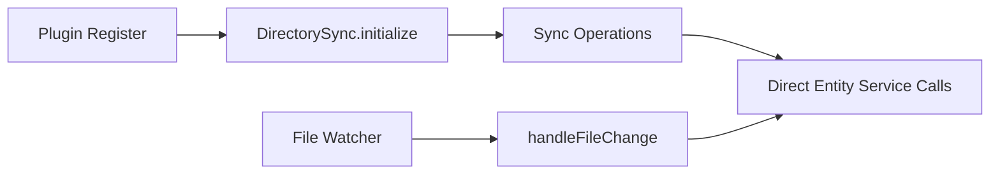
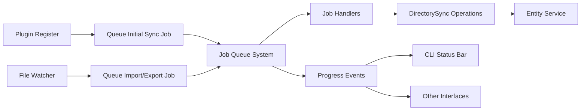

# Directory-Sync Job Queue Integration Plan

## Executive Summary

Convert the directory-sync plugin from synchronous operations to asynchronous job-based operations, enabling visibility of all sync activities in the CLI progress bar and other monitoring interfaces.

## Current State Analysis

### Problem Statement

The directory-sync plugin currently performs operations synchronously:
- **Initial sync** happens during plugin registration (`initialize()`)
- **File watching** triggers immediate import/export operations
- **No visibility** in CLI progress bar or job monitoring systems
- **Blocking operations** during plugin startup

### Current Architecture



### Identified Issues

1. **No Progress Visibility**: Background operations are invisible to users
2. **Startup Blocking**: Initial sync can delay application startup
3. **No Cancellation**: Synchronous operations can't be cancelled
4. **No Retry Logic**: Failed syncs require manual intervention
5. **No Priority Control**: All operations run with same priority

## Proposed Solution

### Architecture Overview

All directory-sync operations will be converted to use the job queue system exclusively. No synchronous fallbacks.



### Key Components

#### 1. New Job Types

```typescript
// Job type definitions
type DirectorySyncJobTypes = {
  "directory-sync": {
    input: DirectorySyncJobData;
    output: SyncResult;
  };
  "directory-import": {
    input: DirectoryImportJobData;
    output: ImportResult;
  };
  "directory-export": {
    input: DirectoryExportJobData;
    output: ExportResult;
  };
};
```

#### 2. Job Data Structures

```typescript
interface DirectorySyncJobData {
  operation: "initial" | "scheduled" | "manual";
  paths?: string[];
  entityTypes?: string[];
  syncDirection?: "import" | "export" | "both";
}

interface DirectoryImportJobData {
  paths?: string[];
  batchSize?: number;
}

interface DirectoryExportJobData {
  entityTypes?: string[];
  batchSize?: number;
}
```

## Implementation Plan

### Phase 1: Infrastructure Setup

#### Task 1.1: Update Configuration Schema
**File**: `plugins/directory-sync/src/types.ts`

```typescript
export interface DirectorySyncConfig {
  syncPath: string;
  watchEnabled?: boolean;
  watchInterval?: number;
  entityTypes?: string[];
  includeMetadata?: boolean;
  initialSync?: boolean;         // Default: true - queue initial sync job
  initialSyncDelay?: number;      // Delay before initial sync (ms)
  syncBatchSize?: number;         // Batch size for operations
  syncPriority?: number;          // Job priority (1-10)
}
```

#### Task 1.2: Create Sync Job Handler
**File**: `plugins/directory-sync/src/handlers/directorySyncJobHandler.ts`

```typescript
export class DirectorySyncJobHandler 
  implements JobHandler<"directory-sync", DirectorySyncJobData, SyncResult> {
  
  constructor(
    private logger: Logger,
    private context: ServicePluginContext,
    private directorySync: DirectorySync,
  ) {}

  async process(
    data: DirectorySyncJobData,
    jobId: string,
    progressReporter: ProgressReporter,
  ): Promise<SyncResult> {
    const startTime = Date.now();
    
    // Import phase
    if (data.syncDirection !== "export") {
      await progressReporter.report({
        progress: 10,
        message: "Scanning directory for changes",
      });
      
      const importResult = await this.importWithProgress(
        data.paths,
        progressReporter,
      );
      
      await progressReporter.report({
        progress: 50,
        message: `Imported ${importResult.imported} entities`,
      });
    }
    
    // Export phase
    if (data.syncDirection !== "import") {
      await progressReporter.report({
        progress: 60,
        message: "Exporting entities to directory",
      });
      
      const exportResult = await this.exportWithProgress(
        data.entityTypes,
        progressReporter,
      );
      
      await progressReporter.report({
        progress: 100,
        message: `Sync complete: ${importResult.imported} imported, ${exportResult.exported} exported`,
      });
    }
    
    return {
      import: importResult,
      export: exportResult,
      duration: Date.now() - startTime,
    };
  }
  
  private async importWithProgress(
    paths: string[] | undefined,
    reporter: ProgressReporter,
  ): Promise<ImportResult> {
    // Implementation with progress reporting
  }
  
  private async exportWithProgress(
    entityTypes: string[] | undefined,
    reporter: ProgressReporter,
  ): Promise<ExportResult> {
    // Implementation with progress reporting
  }
  
  validateAndParse(data: unknown): DirectorySyncJobData | null {
    return directorySyncJobSchema.safeParse(data).data || null;
  }
}
```

### Phase 2: Plugin Integration

#### Task 2.1: Update Plugin Registration
**File**: `plugins/directory-sync/src/plugin.ts`

```typescript
protected override async onRegister(
  context: ServicePluginContext,
): Promise<void> {
  // Initialize directory structure only (no sync)
  await this.directorySync.initializeDirectory();
  
  // Register job handlers first
  await this.registerJobHandlers(context);
  
  // Queue initial sync if enabled
  if (this.config.initialSync) {
    setTimeout(async () => {
      const jobId = await this.queueSyncJob(context, "initial");
      this.logger.info("Queued initial sync job", { 
        jobId,
        delay: this.config.initialSyncDelay,
      });
    }, this.config.initialSyncDelay || 1000);
  }
  
  // Setup file watcher with job queue integration
  if (this.config.watchEnabled) {
    this.setupFileWatcher(context);
  }
}

private async queueSyncJob(
  context: ServicePluginContext,
  operation: string,
): Promise<string> {
  return context.enqueueJob("directory-sync", {
    operation,
    syncDirection: "both",
    entityTypes: this.config.entityTypes,
  }, {
    priority: this.config.syncPriority || 3,
    source: "directory-sync",
    metadata: {
      rootJobId: createId(),
      operationType: "file_operations",
      operationTarget: this.config.syncPath,
      pluginId: "directory-sync",
    },
  });
}
```

#### Task 2.2: Convert File Watcher
**File**: `plugins/directory-sync/src/lib/directory-sync.ts`

```typescript
export class DirectorySync {
  private jobQueueCallback?: (job: JobRequest) => Promise<string>;
  
  // Split initialize into two methods
  async initializeDirectory(): Promise<void> {
    // Only create directory structure
    if (!existsSync(this.syncPath)) {
      mkdirSync(this.syncPath, { recursive: true });
    }
  }
  
  async initialize(): Promise<void> {
    await this.initializeDirectory();
    // Start watching if enabled
    if (this.watchEnabled) {
      this.startWatching();
    }
  }
  
  setJobQueueCallback(
    callback: (job: JobRequest) => Promise<string>,
  ): void {
    this.jobQueueCallback = callback;
  }
  
  private async handleFileChange(
    event: string,
    path: string,
  ): Promise<void> {
    if (!path.endsWith(".md")) return;
    
    // Always queue job - no synchronous fallback
    if (!this.jobQueueCallback) {
      this.logger.warn("File change ignored - no job queue callback", {
        event,
        path,
      });
      return;
    }
    
    const jobType = event === "unlink" 
      ? "directory-export" 
      : "directory-import";
    
    await this.jobQueueCallback({
      type: jobType,
      data: { paths: [path] },
    });
    
    this.logger.debug("Queued job for file change", {
      event,
      path,
      jobType,
    });
  }
}
```

### Phase 3: Progress Enhancement

#### Task 3.1: Batch Processing with Progress
**File**: `plugins/directory-sync/src/lib/directory-sync.ts`

```typescript
async importEntitiesWithProgress(
  paths: string[] | undefined,
  progressReporter: ProgressReporter,
  batchSize: number = 10,
): Promise<ImportResult> {
  const files = paths || await this.scanDirectory();
  const total = files.length;
  const result: ImportResult = {
    imported: 0,
    skipped: 0,
    failed: 0,
    errors: [],
  };
  
  for (let i = 0; i < total; i += batchSize) {
    const batch = files.slice(i, i + batchSize);
    const batchResult = await this.importBatch(batch);
    
    result.imported += batchResult.imported;
    result.skipped += batchResult.skipped;
    result.failed += batchResult.failed;
    result.errors.push(...batchResult.errors);
    
    const progress = Math.round((i + batch.length) / total * 100);
    await progressReporter.report({
      progress,
      message: `Importing: ${i + batch.length}/${total} files processed`,
    });
  }
  
  return result;
}
```

### Phase 4: Testing & Migration

#### Task 4.1: Update Tests
- Test job handler with mock DirectorySync
- Test progress reporting
- Test file watcher job queuing
- Test initial sync delay

#### Task 4.2: Configuration Examples
Since we're not maintaining backward compatibility, all directory-sync operations will now use the job queue system exclusively.

## Success Metrics

### Functional Requirements
- [ ] All sync operations appear in CLI progress bar
- [ ] Initial sync doesn't block plugin registration
- [ ] File watch events queue jobs instead of direct operations
- [ ] Progress updates show meaningful information
- [ ] Jobs can be cancelled/retried

### Performance Requirements
- [ ] Plugin startup time < 100ms (excluding queued jobs)
- [ ] Job queue overhead < 10ms per operation
- [ ] Batch processing reduces entity service calls by 50%

### User Experience
- [ ] Users see "Syncing directory..." in status bar
- [ ] Progress shows "15/47 files imported"
- [ ] Completion shows summary "✓ Sync complete: 47 imported, 12 exported"
- [ ] Errors are visible in status bar

## Risk Analysis

### Risks
1. **Job Queue Overload**: Too many file change events
   - **Mitigation**: Debounce file watcher events
   
2. **Progress Spam**: Too many progress updates
   - **Mitigation**: Throttle progress updates to max 1/second

3. **Race Conditions**: Multiple sync jobs running simultaneously
   - **Mitigation**: Use job queue locking or single-instance constraint

## Timeline

### Week 1: Infrastructure
- [ ] Create job handlers
- [ ] Update configuration schema
- [ ] Write unit tests

### Week 2: Integration
- [ ] Update plugin registration
- [ ] Convert file watcher
- [ ] Integration tests

### Week 3: Polish
- [ ] Progress reporting optimization
- [ ] Error handling improvements
- [ ] Documentation updates

## Appendix

### A. Related Systems
- Job Queue System: `shell/job-queue`
- Progress Monitor: `shell/job-queue/src/job-progress-monitor.ts`
- CLI Interface: `interfaces/cli/src/cli-interface.ts`

### B. Configuration Examples

```typescript
// Minimal configuration - will queue initial sync
const minimalConfig = {
  syncPath: "./data",
};

// Full configuration
const fullConfig = {
  syncPath: "./data",
  watchEnabled: true,
  watchInterval: 1000,
  entityTypes: ["note", "topic"],
  includeMetadata: true,
  initialSync: true,
  initialSyncDelay: 2000,
  syncBatchSize: 20,
  syncPriority: 3,
};

// Performance-optimized
const performanceConfig = {
  syncPath: "./data",
  initialSync: false,      // No automatic sync on startup
  syncBatchSize: 50,       // Large batches for efficiency
  syncPriority: 1,         // Low priority background work
};

// Development configuration
const devConfig = {
  syncPath: "./data",
  initialSync: true,
  initialSyncDelay: 0,     // Immediate sync for testing
  syncBatchSize: 5,        // Small batches to see progress
  syncPriority: 10,        // High priority for testing
};
```

### C. Progress Message Examples

```
🔄 Directory sync in progress
📊 Progress: 15/47 files (32%)
📂 Target: ./data

✅ Directory sync completed
📊 Imported: 47 files
📤 Exported: 12 entities
⏱️ Duration: 3.2s

❌ Directory sync failed
📊 Processed: 15/47 files
❗ Error: Permission denied
```